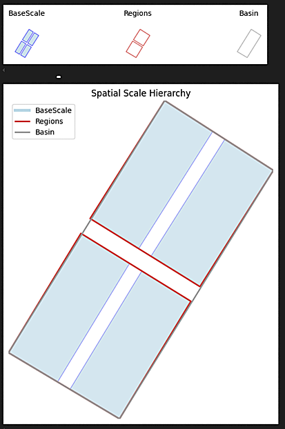

# Generic Scaling-up Framework

A framework for hierarchical data aggregation across spatial scales, with a specific focus on scaling up the evaluation of rivers, wetlands, and floodplains within large river systems such as the Murray–Darling Basin.

## Overview

A fundamental challenge in landscape ecology is **how to transfer ecological information across spatial scales while preserving biological relevance and statistical validity**.

This framework is a Python code library developed as a small research project within the [Flow-MER project](https://www.flow-mer.org.au/).

The framework is used to:

- Aggregate fine-resolution ecological data to larger, management-relevant scales  
- Facilitate repeatability in the calculation of weighted metrics that summarize larger areas from smaller-scale building blocks

---

### The Scale Challenge

In landscape ecology, **scale** refers to both the spatial extent (how large an area) and the resolution (how fine the detail) of ecological observations.

Ecological systems often exhibit hierarchical organization, where smaller units nest within larger ones:

```text
Individual Wetlands → River Reaches → Sub-catchments → Catchments → Bioregions
    (Fine scale)                                                    (Broad scale)
```

Issues of scale complicate the study and management of natural systems where:

1. **Ecological processes operate at multiple scales simultaneously**
   - Individual organisms respond to local habitat conditions
   - Populations are influenced by landscape connectivity
   - Communities are shaped by regional climate patterns

2. **Management decisions occur at different scales than data collection**
   - Data: Individual wetlands, vegetation plots, monitoring sites
   - Management: River reaches, catchments, bioregions

3. **Scale-dependent patterns emerge**
   - Rare species may appear absent at fine scales but present at broad scales
   - Habitat fragmentation effects vary with observation scale
   - Water quality patterns differ between local and regional assessments

### Aggregation Challenges

Simple averaging of fine-scale data can be ecologically misleading due to:

1. **Unequal representation**: Large habitats should influence regional patterns more than small ones
2. **Functional differences**: Different habitat types contribute differently to ecosystem services
3. **Spatial autocorrelation**: Nearby observations are not independent
4. **Edge effects**: Boundaries between management units may not reflect ecological boundaries

The framework uses spatial datasets (e.g., shapefiles or GeoPackages) to model spatial relationships (e.g., smaller patches within larger regions). Data attached to the smallest-scale features (the "building blocks") are then scaled up using spatial joins and weighted averages.

Hierarchical aggregation can occur stepwise: e.g., wetlands → catchments → entire river basin.

Metric aggregation uses a `weighted mean formula`  in several configurations.

```[]
        Aggregated_Value = Σ(Metric_i × Weight_i) / Σ(Weight_i)

        Where weights vary by method:
        - Area-weighted: Weight_i = Area_i (hectares)
        - Length-weighted: Weight_i = Length_i (meters)
        - Count-based: Weight_i = 1 (equal weighting)
        - Sum (of attributes): Weight_i = metric_value_i
        - Frequency-weighted: Weight_i = Frequency_i / Total_frequency
```

## This Framework


### 1. Data Loading and Validation

- Supports Shapefile and GeoPackage to represent spatial scales
- Geometry validation and repair
- Customizable intersection rules (e.g., intersects, within, contains)
- Load tabular data (CSV) in wide or long format to join with spatial entities

### 2. Functional Group Classification

- A reclassification dictionary can be applied to re-group the data. e.g. different types of forest becomes 'trees', or lakes, swamps and marshes could be grouped to a single 'wetland' class
- Handles variations in naming conventions across datasets
- Maintains traceability of classification decisions

### 3. Aggregation

| Method | Use Case | Weighting | Example |
|--------|----------|-----------|---------|
| `area_weighted` | Habitat metrics | Polygon area | Wetland or vegetation condition scores — larger habitats contribute more|
| `length_weighted` | Corridor analysis | Line length | Riparian vegetation health aggregated from river segments to reaches |
| `count` | Site-based data | Equal weighting | Species records or frequency of management actions |
| `sum` | Additive quantities | None | Measures like abundance, risk, or conservation priority |
| `frequency_weighted` | Compositional data | Type frequency | Diversity of habitat types or management actions|

### 4. Visualization and Reporting

- some simple helper routines are provided to visualise scale boundary relationships and metric values across scales.

e.g. plotting the test data hierarchy shows the 4x rectangular "base-scale" polygons that are located within 2 x "regions" that are themselves located within a larger rectangle representing a river "Basin"



### 5.  Export results to CSV, shapefile or GeoPackage

- metrics associated with base-scale objects are "up-scaled" e.g. as area/length weighted averages and joined to the larger polygon features they represent and can be saved as ESRI shapefiles or open-source geopackages (the latter having an advantage of not truncating long column headers).

## Quick Start

Follow the included jupyter notebook.

`test_framework.ipynb`

Runs a complete example using generated test data. It demonstrates:

- Reclassification using a reclass_map
- Visualising the spatial hierarchy
- Loading supplemental CSV data
- calculating area and frequency weighted averages
- Visualising the results

## Requirements

- python
- pandas
- geopandas
- matplotlib
- ipykerne/jupyter

```bash

# Install dependencies
pip install -r requirements.txt

```

## Author and Licence

**Open Source** - Creative Commons v4 - go for it.

**Citation:**  Brooks S (2025). Scaling Framework: Flow-MER Program. Commonwealth Environmental Water Holder, Australian Government Department of Climate Change, Energy, the Environment and Water. Sourced from [https://github.com/brooks-eco/scaling-framework](https://github.com/brooks-eco/scaling-framework)


